# DRAFT
# REQUEST FOR QUOTE #18-0018
# United States Tax Court
# Electronic Filing — Case Management System (EF-CMS)

## Appendix C: Case Processing Workflows

This Appendix C outlines each of the case processing workflows that the Court expects will be supported by a future EF-CMS, through a narrative description of each process, followed by figures depicting the current workflows of the Court. The workflows depict the Court’s internal processes and not those of its current case management system.

The following abbreviations are used throughout the figures:

- CI: Case Initiation
- DM: Docket Management
- CS: Calendaring and Scheduling
- TH: Trials and Hearings
- OR: Opinion Release and Publication
- CD: Case Disposition and Closure

The following symbols are used throughout the figures:

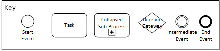

The integrated figure below depicts the current relationship between these various case processing workflows.

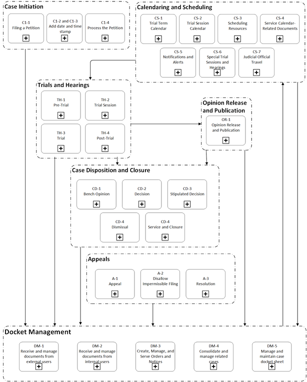

### Case Initiation

The Court expects that a future EF-CMS solution will provide support for the Court’s case initiation process, described as follows:

A Tax Court case will be initiated by the filing of a Petition in one of three ways:

1. Hand-delivering a paper Petition to the Tax Court in Washington, D.C.;
2. Mailing a paper Petition to the Tax Court in Washington, D.C.; or
3. Filing a Petition electronically.

A complete Petition packet should include a Petition that complies with the Court’s Rule 34, a copy of the IRS notice on which the Court’s jurisdiction is based (if any), a Request for Place of Trial, a Statement of Taxpayer Identification, and the Court’s filing fee. However, many Petitions do not conform with the Tax Court Rules, and some of the documents submitted will not become part of the official docket record. The Court expects a future EF-CMS will allow for the processing of these documents that are not part of the record.

Receipt of Petition: If a paper Petition is hand-delivered to the Court, a Court employee will stamp it with the date and time it was received, and provide the person who delivered it to the Court with a receipt. If a paper Petition is mailed to the Court, a Court employee will open the envelope and stamp the paper Petition with the date and time it was received. A person wishing to file a Petition electronically will be required to first register with the Court through the Court’s electronic filing system.

Initial Processing: All paper and electronic Petitions will be assigned a docket number in each calendar year’s sequential order through System-prompted authorized user action. Court employees will scan and upload paper Petitions to the Court’s document/case management system. An internal Court user will then review the Petition and all documents submitted along with it, and enter or verify certain attributes of data related to the case (e.g., Petitioner’s name and address, type of case, amount in dispute, regular or small case election, place of trial, etc.). The user will then note missing or erroneous information for correction or follow-up.

The Court’s Petition review process will include payment of the Court’s filing fee. Filers will be able to pay the filing fee electronically through pay.gov. The System will allow for filing fees paid through pay.gov to be associated with the appropriate case. In addition, the System will allow for payment of filing fees by check. If paid by check, a Court employee will scan the check for automatic transmittal to the U.S. Treasury. Checks that cannot be scanned for automatic transmission will be manually delivered to the U.S. Treasury. At the end of each day, the System will automatically generate a report summarizing all filing fees received.

Petitioners will also be able to apply for a waiver of the Court’s filing fee. Tax Court employees will review waiver requests as part of Petition processing. Internal Court users will grant or deny the requests based on financial information provided by the filer. If the Court’s filing fee is not paid, or if the fee waiver is denied, the System will prompt the user to issue an Order directing the payment of the fee.

Petitions will also be reviewed for signature. If the Petition is signed by anyone other than the Petitioner, a check will be made as to whether the signer is admitted to practice before the Court. If the signer is an admitted practitioner, the practitioner’s identity will be entered into the case by Tax Court Bar number. If the signer is not admitted to practice before the Court, a letter/notice will be issued to the Petitioner (with a copy to the signer) advising them that the signer of the Petition is not admitted to practice before the Court. An Order will also be prepared directing the Petitioner to ratify the Petition.

Final Processing: Any additional Orders or Notices needed will then be electronically prepared within the System. A copy of the Petition and any related Orders or Notices that have been prepared during the processing of the Petition will then be served on both parties through System-prompted authorized user actions. To the extent any of the Orders include a deadline, the deadline(s) will be entered into a tickler system, along with respondent’s deadline to file an Answer. The System will create a daily Service List of all documents served, and on whom, by the Court.

Case Status: Each case will be assigned a case status to reflect the posture of the case. The case status will change as a case progresses through the Court. The Court expects the future EF-CMS will allow for a case status to be associated with each case, and for that status to change through System-prompted authorized user actions.

#### Case Initiation Activity Sequences

 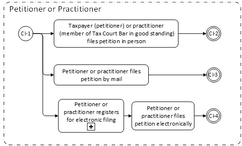

 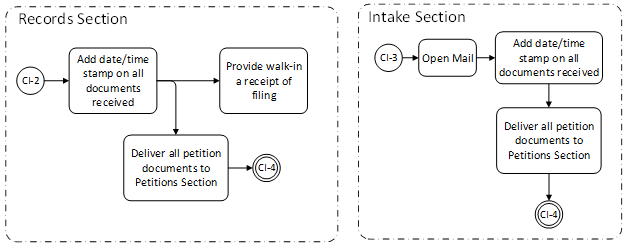

 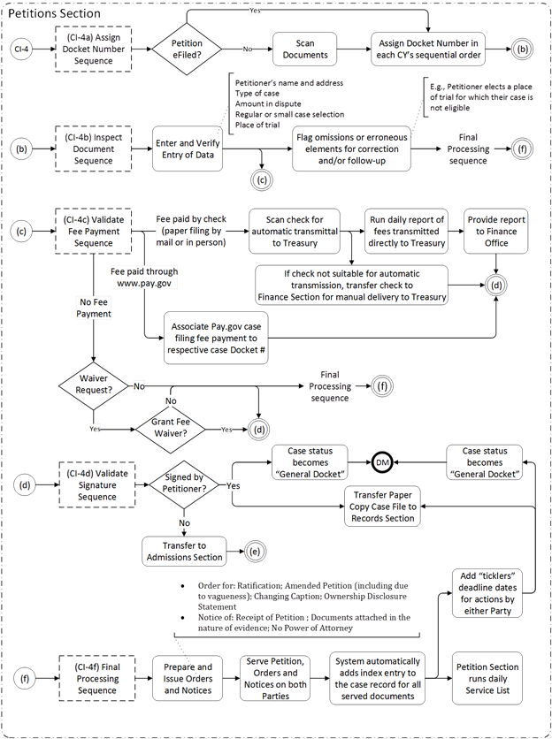

 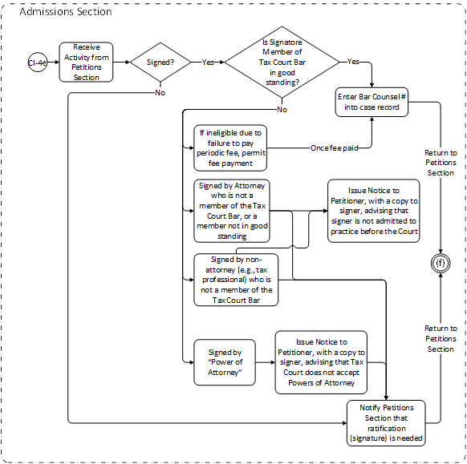

### Docket Management

After a case is initiated, all documents and filings coming into and going out of the Court for that case are routed through Docket. The Court expects that a future EF-CMS will provide support for the Court’s docket management processes, described as follows:

Receiving Documents from External Users: The future EF-CMS must allow for parties to file documents either electronically or in paper. Generally, parties who are represented by counsel must electronically file documents after the case is initiated. Pro se litigants may, but are not required to, register for electronic filing.

If the Court receives a paper document, it will be scanned and uploaded, and then otherwise treated the same as an electronically filed document.

When a document is filed with the Court, it will be automatically added to a case record. The future EF-CMS must allow for the parties to submit certain categories of documents that will not be automatically added to the case record unless approved by an internal Court user. The System must also allow the parties to file sealed documents. The System must allow non-parties to file documents in specific instances.

After a document is added to the case record, the System will automatically generate a cover sheet with the case caption, docket number, title of document or filing, and date and time filed or submitted. The internal Court user will then perform a quality control inspection of the document and make any changes necessary to the docket record to accurately reflect the filing. An internal Court user will then initiate service of the document on the other party (if necessary) and electronically forward it to the appropriate internal user for action within the System. If the filing was in response to a Court Order, the System will prompt an internal user to clear the related due date from the tickler system, or mark it complete.

Court Generated Documents: Internal users will electronically prepare various documents within the System including Orders, Notices, and Decisions. If an Order issued by the Court includes a due date, the due date will be entered into the tickler system and a copy will be served on the parties through System-prompted authorized user actions.

Service on Parties/Counsel: All Tax Court practitioners must register for electronic service. Pro se litigants may, but are not required to, register for electronic service. All documents filed with the Court must be served on the parties. If an internal Court user confirms from a Certificate of Service that a party has already been served, the Court will not serve that party. Otherwise, the Court will serve all documents (internal and external) on all parties, and counsel (if any). The Court will send an email notification with a link to the served document to any party registered for electronic service in that case. If a party is not registered for electronic service, the Court will serve a copy of the document on that party by mail.

Data Attributes: Case-related filings and submissions will be assigned unique codes for purposes of analytics and data extraction. Internal Court users should be able to manually set and modify due dates. The System may suggest and/or auto-populate some due dates associated with documents in the case record into a tickler system. In addition, the future EF-CMS will provide for automatic alerts and recommendations based on defined business rules when certain due dates are triggered.

Case Docket Records and Access: A future EF-CMS will generate case docket sheets that will include the docket number, parties, service parties, counsel, and the docket record which is a list of all filings and official proceedings in a case. Internal users and parties to the case may view all documents filed in a case through the Court’s eFiling portal.

Consolidated and Related Cases: A future EF-CMS will allow for the Court to consolidate two or more pending cases that have common issues and/or parties. The System will allow for both parties and internal Court users to make filings in some or all of the cases in a consolidated group. In addition, the System will also allow for internal Court users to group related cases that are not consolidated.

#### Docket Management Activity Sequences

 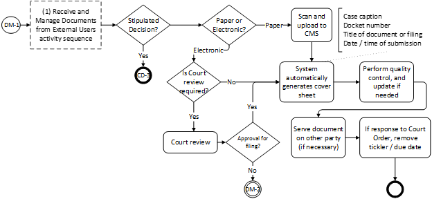

 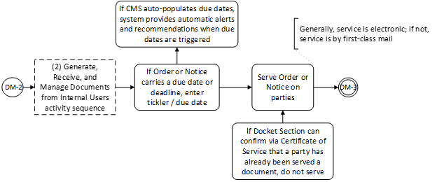

 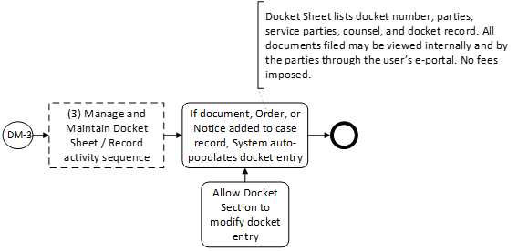

### Calendaring & Scheduling

There are several unique aspects to the Court’s trial calendaring process.

Cases filed in the Tax Court are not assigned to a Judge at the time the case is initiated. Generally, a Tax Court case is placed in "general docket" status until that case, along with other cases, is added to a trial session.

The Court conducts trial sessions in the main courthouse in Washington, D.C., and in 73 other cities throughout the United States. Generally, the Court holds a trial session in each trial city at least once per year. The Court schedules three trial terms per year: Winter, Spring, and Fall. The Court creates a trial term calendar to set forth when and where the Court will hold trial sessions during each term.

All Tax Court cases can be divided into regular and small case categories. Generally, small cases involve $50,000 or less per taxable period. A Petitioner who wishes to proceed under small case procedures must affirmatively elect small case status. Regular cases are all cases that are not small cases. Each trial session can be one of three types: Regular, Small, and Hybrid (a combination of Regular and Small cases). See, e.g., Winter 2018 Term Calendar at https://www.ustaxcourt.gov/court\_schedules/Winter\_2018.pdf.

After a tentative trial term calendar is complete, additional layers of information are added for each trial session, including: the Judge assigned; the specific cases for each trial session; courtroom reservation and contact information; and the trial clerk, court reporter, and security officer assigned. The result of these additional layers of information is an integrated calendar.

 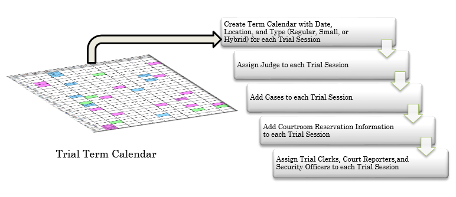

The Court expects that a future EF-CMS will provide support for the Court’s calendaring and scheduling processes, described as follows:

Trial Term Calendar: The Court’s trial term calendaring process for each trial term consists of several steps. First, the Court ascertains the number of cases, by type, that are eligible for trial in each trial city. Next, the Court considers, among other things, the number of cases eligible for each place of trial, the last time a trial session was held in a city, courtroom availability, holidays, other city events, and Low-Income Taxpayer Clinic schedules.

After a tentative trial term calendar is prepared, it is transmitted to the individual Judges of the Court, and they may request assignment to specific trial sessions. After requests are considered, a Judge is then assigned to each trial session, and the official trial term calendar is released. After release, users with necessary permissions will be able to modify the calendar as needed.

Trial Session Calendars: After the trial term calendar is final, approximately 125 cases are automatically assigned to each of the trial sessions to create trial session calendars. Those case assignments are based on criteria that include initial filing date. When a case is added to a trial session calendar, trial session notices and orders will be automatically generated within the System, served on the parties, and added to the case record. In addition, the System will change the case status to "Calendared". Trial session calendars are automatically updated as cases are added or removed. If any changes to the trial session calendar are made, notifications are generated and served on the parties and/or distributed to designated internal and external individuals.

The Court expects that a future EF-CMS will allow for internal Court users to effect global service on all parties, or categories of parties, to cases on a particular trial session.

The Court also expects that a future EF-CMS will allow for the generation of travel authorization forms for Judges and trial clerks for each trial session.

Scheduling of Resources: The Court coordinates the scheduling of space and staff resources for each trial session. The Court expects that a future EF-CMS will incorporate courtroom space and staff information on an integrated calendar, including:

- Reserving courtrooms and chambers in Court-leased spaces in buildings managed by the General Services Administration (GSA).

- Reserving temporary spaces borrowed by the Court from a Federal, State, or local agency.

- Providing contact and other information about courtroom space to internal users.

- Scheduling Trial Clerks, court security, and court reporters.

Notifications/Alerts: The Court expects that a future EF-CMS will allow for notifications and calendar alerts, including alerts that will be sent to Judges assigned to a trial session about cases with certain attributes, and notices that will be sent to specified internal and external stakeholders when a calendar is officially released, modified, cancelled, or at other scheduled times.

Special Trial Sessions and Hearing Sessions: The Court conducts special trial sessions when the projected length of the trial of a case exceeds the time available during a normal week-long trial session. The Court expects that it will schedule hearings and special trial sessions in trial cities in the same manner as trial sessions. Therefore, all of the processes described above will be applicable to hearings and special trial sessions.

Sealed Cases: The Court also expects that a future EF-CMS will support specialized procedures that apply to cases for which the anonymity of a party or witness must to be protected from public disclosure. A future EF-CMS will allow for calendaring sealed hearings or portions thereof for which Court staff need access to the scheduling information but the public does not, and for permitting an internal search for the name of a petitioner where the public-facing name is "anonymous".

#### Calendaring and Scheduling Activity Sequences

 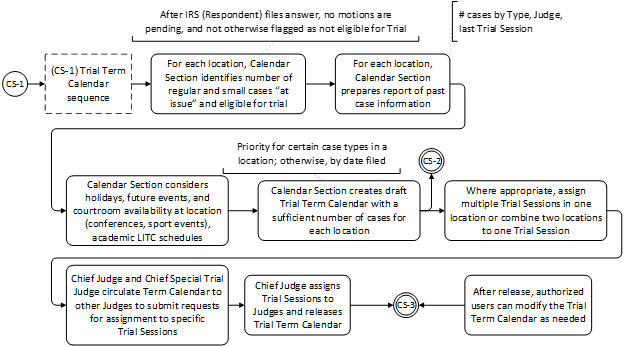

 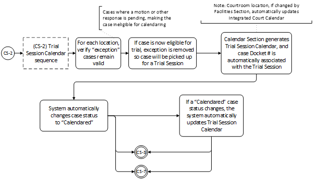

 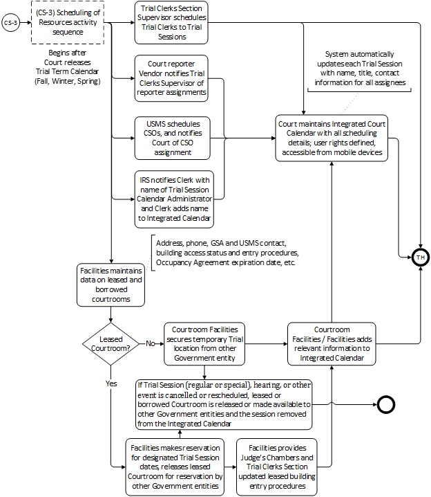

 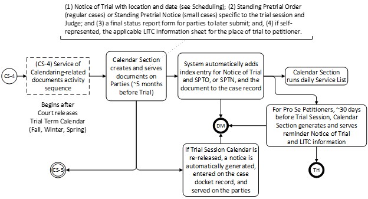

 

 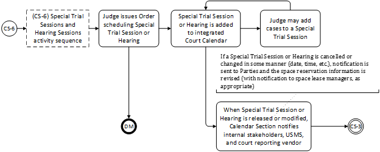

### Trials & Hearings

The Court expects that a future EF-CMS will provide support for the Court’s trials and hearings processes, described as follows:

After a case is scheduled for trial or calendared for hearing, the Judge associated with that trial session or hearing will be sent any documents filed or submitted in that case. A future EF-CMS will allow for (1) real-time access to electronic case records where an Internet connection is available, (2) copies of electronic case records to be downloaded to mobile devices and available for viewing without an Internet connection, and (3) all case records for cases on a particular trial session to be batch downloaded.

The Court also expects that a future EF-CMS will allow for the creation of internal electronic work environments that include (1) the ability to annotate case records, and make and save notes or other files that are associated with a particular case, and (2) the sharing of files and notes between internal users. These work environments must be compatible with note-taking and multi-user collaboration applications. These work environments should be available online and offline. If changes are made offline, those changes will synchronize when Internet connectivity is restored.

On the first morning of each trial session, the trial clerk will call each open case that has not been settled. This process is known as a "Calendar Call". The electronic work environment should allow the Judge to make notes and update the current status of each case. After the Judge has gone through this process for all of the open cases on the calendar, the Judge will take a short recess to plan the trial calendar for the week. The Judge will be able to use the electronic work environment to assist in this planning by sorting cases by status, length of trial time or date preferences, by counsel, or by other fields. After the Judge has decided on a trial schedule for the week, the Judge will announce that schedule to all of the parties.

The Judge may conduct several different trials over the course of the trial session. At the conclusion of each trial, the trial clerk will prepare a Minutes Sheet which serves as the Court’s official trial record of each case. The Court expects a future EF-CMS will allow for the electronic preparation of Minutes Sheets and Orders and transmission to Docket for processing and serving. Any deadlines set by the Judge during the trial session will be entered into the Court’s tickler system, and the case status will be changed to reflect the appropriate status of each case.

The Court expects that a future EF-CMS will automatically transmit a survey to both the Judge and the trial clerk during the trial session so that both can report back on any issues at the trial location to be addressed before the Court returns to that site.

#### Trials and Hearings Activity Sequences

 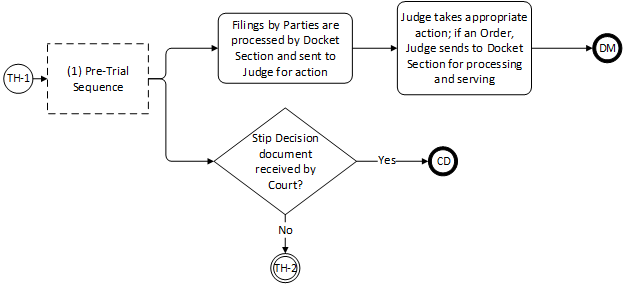

 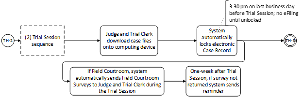

 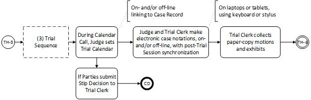

 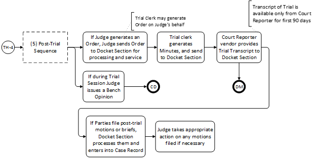

### Opinion Release & Publication

The Court expects that a future EF-CMS will support the Court staff opinion release and publication process. That staff process will be initiated with the transmittal by a Judge’s chambers of the text of an opinion that has been approved for release to the Court’s Reporter of Decisions (Reporter). The Reporter will then electronically transmit the opinion (1) to Docket for service on the parties and for posting on the Court’s Internet website, and (2) to the Government Publishing Office for publication.

#### Opinion Release and Publication Activity Sequence

 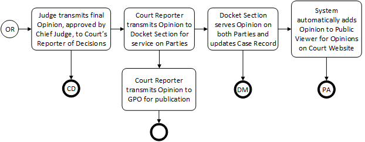

### Case Disposition & Closure

The Court expects that a future EF-CMS will provide support for the Court’s case disposition and closure processes, described as follows:

A Court case can be disposed of in four different ways:

Bench Opinion: A Judge may issue an oral Bench Opinion following a trial during the trial session. The Judge will read onto the record language which constitutes the Bench Opinion. The court reporter will transcribe that Bench Opinion and provide a draft to the Judge for review. The Judge or Clerk may then prepare an Order to the court reporter detailing required changes, and that Order will be served on the court reporter. After a final transcript of a Bench Opinion is approved by the Judge, the court reporter will transmit the Bench Opinion to the Court. The Bench Opinion will be added to the case record and a copy will be served on the parties. The Judge will then issue a Decision. That Decision will be entered into the case record and served on the parties. After the Decision has been entered, the System will change the case status to "Closed."

Decision following Opinion: After a Judge issues an Opinion in a case, that Judge will also issue a Decision. That Decision will be entered into the case record and served on the parties. After the Decision has been entered, the System will change the case status to "Closed."

Stipulated Decision: Many of the Court’s cases are resolved by agreement between the parties without the need for trial or involvement of a judicial officer. In those cases, the parties will prepare, sign, and submit to the Court, either in paper or electronically, a Stipulated Decision detailing the parties’ settlement agreement. Upon receipt of the Stipulated Decision, it will be reviewed to make sure that all issues have been resolved. If approved, the Stipulated Decision will be signed, entered into the case record, and served on the parties. After the Decision has been entered, the System will change the case status to "Closed."

Order: A case may be dismissed by Order for various reasons including lack of jurisdiction, failure to state a claim, failure to prosecute, mootness, and duplication. When dismissed by Order, the Order will be prepared and signed, entered/filed on the case record, and served on the parties. After the Order has been entered/filed, the System will change the case status to "Closed."

#### Case Disposition and Closure Activity Sequences

 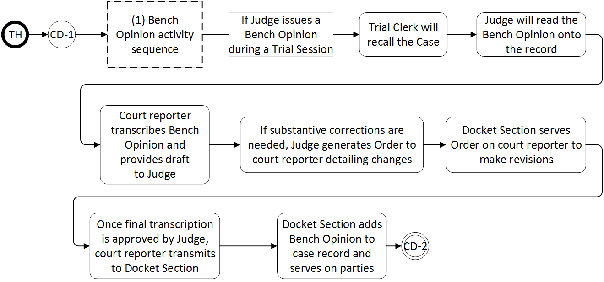

 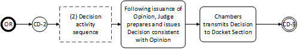

 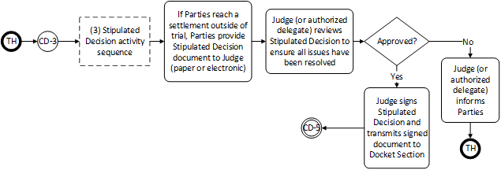

 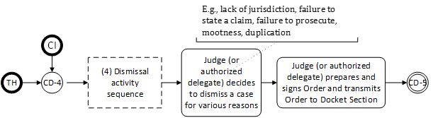

 

### Appeals

The Court expects that a future EF-CMS will provide support for the Court’s Appeals process, described as follows:

An Appeal will be initiated by either party filing with the Court a Notice of Appeal. The future EF-CMS must allow for parties to file a Notice of Appeal either electronically or by paper. If a paper Notice of Appeal is received by the Court, it will be scanned and uploaded, and then otherwise treated the same as an electronically-filed Notice of Appeal.

After a Notice of Appeal is filed, it will be added to the case record and the System will change the case status to "On Appeal." The Court will issue and serve a Notice of Filing of Notice of Appeal on both parties, the Department of Justice, and the Court of Appeals. The Court will also process any Appellate filing fee.

After the Notice of Appeal is processed, the Court will transmit the Tax Court case file to the Court of Appeals.

The future EF-CMS will be capable of limiting the types of documents that can be filed while the case is in "On Appeal" status. If either party files a permissible document by paper or electronically while the case is "On Appeal", that document will be processed using the Court’s normal document processing procedures described in Docket Management. If either party attempts to file an impermissible document while the case is "On Appeal," that document will be returned to the filing party unfiled (if filed in paper) or stricken from the record (if filed electronically).

After the Court receives a Mandate from the Court of Appeals, it will be filed as part of the Tax Court case record. If Mandate provides that the Court’s decision is affirmed in full by the Court of Appeals, the case status will be changed to "Closed" after the Mandate is filed. If the Court’s decision is not affirmed in full, the Court will issue an Order assigning the case to a Judge for further action. After a subsequent Order/Decision is entered, the System will change the case status to "Closed."

#### Appeals Activity Sequences

 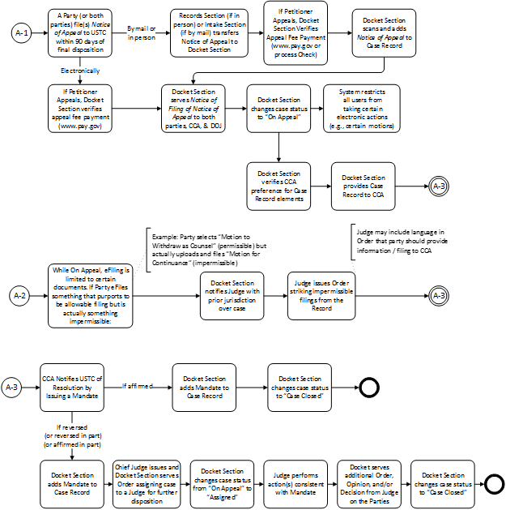

CCA = Circuit Court of Appeals

DOJ = Department of Justice
